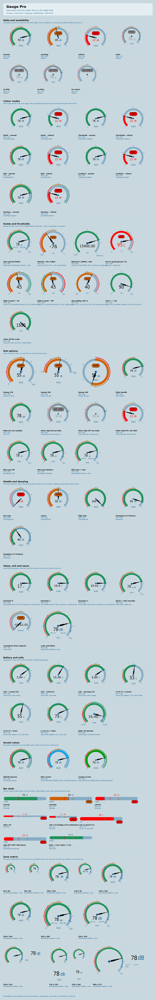

# Gauge Pro — EdgeTX responsive telemetry instrument

> **Full user & technical reference: [`DOCS.md`](DOCS.md)**
> **Every option, in one image: [`docs/gauge-pro-options.png`](docs/gauge-pro-options.png)**
> **Design & engineering plan: [`IMPROVEMENT_PLAN.md`](IMPROVEMENT_PLAN.md)**

A modern successor to the community `GaugeRotary`: a responsive
analog-digital instrument for EdgeTX color radios (LVGL, EdgeTX 2.11+,
developed against EdgeTX 3.0).

*(Developed under the name `GaugeV2`; the folder, the widget name and the
option defaults all moved to `GaugePro` before release, so no model config
carries the old name.)*

`WIDGETS/GaugePro/` mirrors the SD-card layout — copy the folder to the radio's
`WIDGETS/` directory (or into the Companion simulator SD content) and add the
widget to a color-LCD screen.

It is the only EdgeTX widget that draws with the **LVGL retained-object API**
(`lvgl.arc`, `lvgl.triangle`, `lvgl.line`) rather than the legacy `lcd`
renderer, so one folder serves every screen size with no per-resolution
assets.

## Every option, in one image

[](docs/gauge-pro-options.png)

**[`docs/gauge-pro-options.png`](docs/gauge-pro-options.png)** — 78 scenes
covering every option, every state, every colour mode and every zone size an
EdgeTX layout can hand out, on EdgeTX's **stock theme**.
[`docs/gauge-pro-options-dark.png`](docs/gauge-pro-options-dark.png) is the same
sheet on a dark theme, and both are also committed as SVG
([stock](docs/gauge-pro-options.svg), [dark](docs/gauge-pro-options-dark.svg))
if you want to zoom in without artefacts.

Nothing in those images is a mock-up: every tile is the widget's own LVGL
object tree, built by the real code from the real option values and emitted as
SVG. Regenerate with `lua5.3 dev/collage.lua ./ docs/`.

## Features

- Any numeric source: telemetry sensors, timers, sticks, channels, gvars, TX
  battery — with auto-discovery of the first available of RSSI/RQly/RxBt/
  Cels/TxBt
- Dial with threshold rail, progress arc, **three-segment tapered needle**,
  pivot ring, adaptive major/minor ticks, scale end labels
- **Linear bar style** for wide/short zones, chosen automatically where a dial
  cannot work
- Colour modes: Static, Threshold, **Rail** (default), **Gradient**, Sections
- Sweeps: 270°, 180°, 360°
- Semantic states with **hysteresis** (no flicker on a threshold), a filled
  state badge, and a critical pulse that survives greyscale
- A **status / data colour split**: the arc and badge carry the state, the
  numbers stay on the theme's own text role. The three state colours are fixed
  and measured to clear 3 : 1 on both a light and a dark background — see
  [`DOCS.md` §4.3](DOCS.md)
- **Peak-hold ghost** plus min/max markers, sourced from the radio's own
  `<sensor>-` / `<sensor>+` sensors where they exist
- **Battery intelligence**: cell-count detection, per-cell / total / average
  cell readings, and Li-Po/Li-Ion state-of-charge percentage
- **Alerts**: tone and haptic on state transitions, gated by a switch, a
  startup delay and a rate limit
- Reset min/max from a switch, in flight
- Accent colour, custom name and unit, needle damping
- Responsive: micro / compact / normal / large × horizontal / vertical /
  balanced / fullscreen
- Availability model: distinguishes no source, stale sensor, link down and
  missing data; keeps the last known value; snaps the needle on reconnect
- Theme integration: everything but the three state colours is a
  `COLOR_THEME_*` role, and the badge reads the theme at runtime to pick its
  own label ink

## Options

Ten options on EdgeTX 2.11 (the firmware limit there, in both the radio and
Companion), and 23 on 2.12+. The core ten keep fixed positions on every
firmware, so a model can move between versions without its settings shifting.
See [`DOCS.md` §4.1](DOCS.md).

## Architecture

`main.lua` is boot-weight only — it is executed at radio startup for every
widget on the card, used or not. Everything else loads on first use:

| File | Responsibility |
|---|---|
| `main.lua` | option declarations, version gate, `lvgl` guard |
| `app.lua` | lifecycle, config → ranges → layout, rebuild decisions |
| `options.lua` | the option wire format (integers, 1-based choices, capacity) |
| `theme.lua` | design tokens and memoized text metrics |
| `geometry.lua`, `ranges.lua`, `presets.lua`, `format.lua`, `smoothing.lua` | pure Lua domain logic |
| `telemetry.lua` | sources, values, availability, history |
| `layout.lua` | classification, geometry, typography, regions |
| `renderer.lua`, `bar.lua` | retained LVGL trees, property-only updates |
| `alerts.lua` | transition alerts |

## Testing

Stock Lua 5.3, no radio needed:

```sh
lua5.3 tests/run_tests.lua  ./          # pure modules        (38 tests)
lua5.3 tests/smoke_test.lua ./          # lifecycle          (137 tests)
lua5.3 dev/collide.lua      ./          # geometric collision audit
lua5.3 dev/gallery.lua      ./ /tmp/g   # visual contract sheet + manifest
lua5.3 dev/collage.lua      ./ docs/    # the official option sheet (committed)
```

The mock enforces the firmware's real contract — property allow-lists per
object type, `{x, y}` point arrays, the missing string metatable, 10 ms
`getTime()` ticks, and the **integer option wire format with 1-based
choices**.

Three tools share one catalogue (`dev/scenes.lua`) and one emitter
(`dev/svgkit.lua`), so they cannot disagree about what the widget draws:

| Tool | Audience | Output |
|---|---|---|
| `dev/collage.lua` | users | the committed sheet in `docs/`, English, no diagnostics |
| `dev/gallery.lua` | review | contract sheet + manifest, overflow boxes, warning dots, option-coverage audit |
| `dev/shots.lua` | close-up | one SVG per scene |

The gallery renders every scene in both palettes plus a deterministic manifest
of what each scene resolved to — layout mode, availability, colour key, scale,
object census — and reports which widget options no scene ever varies. Use
`--baseline <manifest>` for a field-level diff of what a change moved. See
**DOCS.md §7.1–7.2** for the workflow and for how to add a scene, a source or
an option.

The palettes are EdgeTX's **real** ones: `stock` is `colors.cpp`'s
`defaultColors` byte for byte. That matters more than it sounds — the tools
used to paint an invented palette, and it hid a normal state rendering at
1.13 : 1 on a stock radio for four review rounds.

`dev/preview.lua` is the older single-page preview (`dev/preview.html` is
generated — regenerate it rather than editing it).

## Compatibility

- EdgeTX 2.11+ (LVGL Lua API). On older firmware the widget registers and
  shows a compatibility message instead of vanishing from the model.
- No legacy `lcd` renderer.
- `destroy` is not a widget callback in EdgeTX and is not used.

## License

GPLv2 — see the header of each file.
